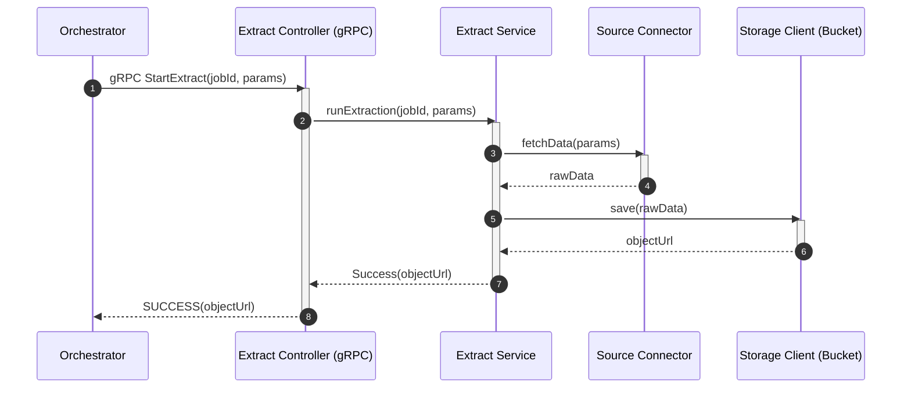

# Extract Service

Service Extract pour un projet ETL distribué.
Ce service est responsable de la phase d’extraction des données depuis différentes sources et de leur dépôt dans un espace de stockage intermédiaire (bucket).

---

## Responsabilités du service

Le service Extract est responsable de :

- Recevoir une demande d’extraction depuis l’Orchestrator via gRPC
- Se connecter à une ou plusieurs sources de données (API, base de données, fichiers, etc.)
- Extraire les données selon les paramètres fournis
- Effectuer une validation minimale des données extraites
- Stocker les données brutes dans un bucket (ex : stockage objet type S3/MinIO)
- Retourner à l’Orchestrator les métadonnées nécessaires (ex : URL du fichier, identifiant de job, statut)
- Gérer les erreurs et remonter les statuts d’échec

Le service ne doit **pas** :
- Transformer les données (responsabilité du service Transform)
- Charger les données en base finale (responsabilité du service Load)
- Gérer la logique métier globale du workflow (responsabilité de l’Orchestrator)

---

## Fonctionnalités principales à implémenter

### 1. Endpoint gRPC

- Méthode `StartExtract()`
  - Paramètres :
    - Identifiant du job
    - Type/source des données
    - Paramètres d’extraction (date range, filtres, etc.)
  - Retour :
    - Statut (SUCCESS / FAILURE)
    - URL ou identifiant du fichier généré
    - Métadonnées éventuelles

---

### 2. Gestion des connexions aux sources

- Connecteur(s) vers :
  - Base de données (ex : PostgreSQL, MySQL…)
  - API externe
  - Fichiers (CSV, JSON…)
- Gestion sécurisée des credentials
- Timeout et gestion des erreurs réseau

---

### 3. Gestion du stockage

- Écriture des données brutes dans un bucket
- Convention de nommage des fichiers, par exemple :
  - `jobId/source/timestamp.ext`
- Gestion des collisions
- Possibilité de compression (optionnelle)

---

### 4. Gestion des erreurs

- Retry automatique configurable
- Logging structuré
- Remontée d’erreurs explicites à l’Orchestrator
- Distinction entre :
  - Erreur technique (connexion, timeout)
  - Erreur fonctionnelle (données invalides)

---

### 5. Observabilité

- Logs corrélés par `jobId`
- Métriques :
  - Temps d’extraction
  - Volume de données extrait
  - Nombre d’erreurs
- Healthcheck endpoint

---

## Questions à discuter en équipe

- Quelles sources de données doivent être supportées au MVP ?
- Le format de sortie doit-il être unique (ex : toujours JSON) ?
- Faut-il normaliser les données dès l’extraction ou garder un format totalement brut ?
- Quelle est la taille maximale attendue des datasets ?
- Doit-on supporter l’extraction incrémentale (delta) ?
  - Une extraction incrémentale (ou delta) consiste à extraire uniquement les nouvelles données ou les données modifiées depuis la dernière extraction, au lieu de tout recharger à chaque fois.
- Combien de retries sont autorisés avant échec définitif ?
- Qui est responsable du nettoyage des fichiers temporaires ?
- Le service doit-il être idempotent (même jobId → même résultat) ?
  - Appeler plusieurs fois la même opération avec les mêmes paramètres produit le même résultat sans effet secondaire supplémentaire.
- Faut-il prévoir un mécanisme de cache côté Extract ?
- Les credentials sont-ils fournis par l’Orchestrator ou stockés côté Extract ?

---

## Début d’architecture

### Composants internes pressentis

- `ExtractController`  
  Point d’entrée gRPC

- `ExtractService`  
  Logique métier principale

- `SourceConnector` (interface)  
  Implémentations :
  - `DatabaseConnector`
  - `ApiConnector`
  - `FileConnector`

- `StorageClient`  
  Gestion de l’écriture dans le bucket

- `RetryManager`

- `Logger / MonitoringAdapter`

---

## Diagramme de séquence

## Évolutions futures possibles

- Support du streaming pour gros volumes
- Extraction parallèle
- Gestion multi-sources dans un même job
- Versioning des datasets
- Validation avancée des schémas

## Positionnement dans l’architecture globale

Le service Extract :

- Est appelé uniquement par l’Orchestrator via gRPC
- Dépose les données dans un bucket intermédiaire
- Ne communique pas directement avec Transform ou Load
- Est stateless (idéalement)
- Peut être scalé horizontalement