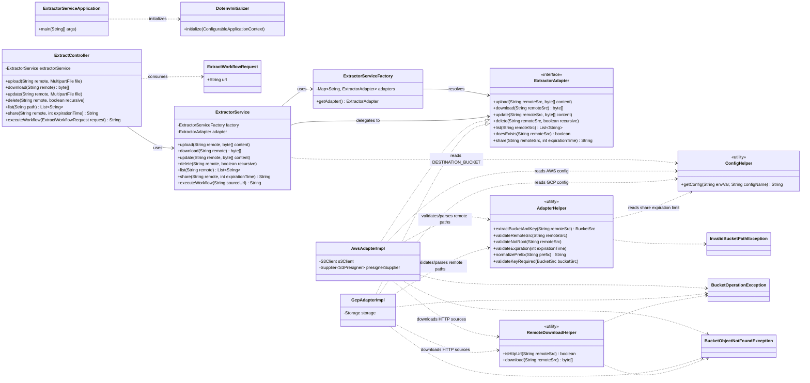

# Class Diagram

This diagram reflects the current Spring Boot extractor structure at a high level.
It focuses on the application classes and their main dependencies.

```mermaid
classDiagram
direction LR

class ExtractorServiceApplication {
  +main(String[] args)
}

class DotenvInitializer {
  +initialize(ConfigurableApplicationContext)
}

class ExtractController {
  -ExtractorService extractorService
  +upload(String remote, MultipartFile file)
  +download(String remote) byte[]
  +update(String remote, MultipartFile file)
  +delete(String remote, boolean recursive)
  +list(String path) List~String~
  +share(String remote, int expirationTime) String
  +executeWorkflow(ExtractWorkflowRequest request) String
}

class ExtractWorkflowRequest {
  +String url
}

class ExtractorService {
  -ExtractorServiceFactory factory
  -ExtractorAdapter adapter
  +upload(String remote, byte[] content)
  +download(String remote) byte[]
  +update(String remote, byte[] content)
  +delete(String remote, boolean recursive)
  +list(String remote) List~String~
  +share(String remote, int expirationTime) String
  +executeWorkflow(String sourceUrl) String
}

class ExtractorServiceFactory {
  -Map~String, ExtractorAdapter~ adapters
  +getAdapter() ExtractorAdapter
}

class ExtractorAdapter {
  <<interface>>
  +upload(String remoteSrc, byte[] content)
  +download(String remoteSrc) byte[]
  +update(String remoteSrc, byte[] content)
  +delete(String remoteSrc, boolean recursive)
  +list(String remoteSrc) List~String~
  +doesExists(String remoteSrc) boolean
  +share(String remoteSrc, int expirationTime) String
}

class AwsAdapterImpl {
  -S3Client s3Client
  -Supplier~S3Presigner~ presignerSupplier
}

class GcpAdapterImpl {
  -Storage storage
}

class AdapterHelper {
  <<utility>>
  +extractBucketAndKey(String remoteSrc) BucketSrc
  +validateRemoteSrc(String remoteSrc)
  +validateNotRoot(String remoteSrc)
  +validateExpiration(int expirationTime)
  +normalizePrefix(String prefix) String
  +validateKeyRequired(BucketSrc bucketSrc)
}

class RemoteDownloadHelper {
  <<utility>>
  +isHttpUrl(String remoteSrc) boolean
  +download(String remoteSrc) byte[]
}

class ConfigHelper {
  <<utility>>
  +getConfig(String envVar, String configName) String
}

class BucketOperationException
class BucketObjectNotFoundException
class InvalidBucketPathException

ExtractorServiceApplication ..> DotenvInitializer : initializes
ExtractController --> ExtractorService : uses
ExtractController ..> ExtractWorkflowRequest : consumes
ExtractorService --> ExtractorServiceFactory : uses
ExtractorServiceFactory --> ExtractorAdapter : resolves
ExtractorService --> ExtractorAdapter : delegates to
ExtractorService ..> ConfigHelper : reads DESTINATION_BUCKET

AwsAdapterImpl ..|> ExtractorAdapter
GcpAdapterImpl ..|> ExtractorAdapter

AwsAdapterImpl ..> AdapterHelper : validates/parses remote paths
AwsAdapterImpl ..> RemoteDownloadHelper : downloads HTTP sources
AwsAdapterImpl ..> ConfigHelper : reads AWS config

GcpAdapterImpl ..> AdapterHelper : validates/parses remote paths
GcpAdapterImpl ..> RemoteDownloadHelper : downloads HTTP sources
GcpAdapterImpl ..> ConfigHelper : reads GCP config

AdapterHelper ..> ConfigHelper : reads share expiration limit

AwsAdapterImpl ..> BucketOperationException
AwsAdapterImpl ..> BucketObjectNotFoundException
GcpAdapterImpl ..> BucketOperationException
GcpAdapterImpl ..> BucketObjectNotFoundException
AdapterHelper ..> InvalidBucketPathException
RemoteDownloadHelper ..> BucketOperationException
RemoteDownloadHelper ..> BucketObjectNotFoundException
```
