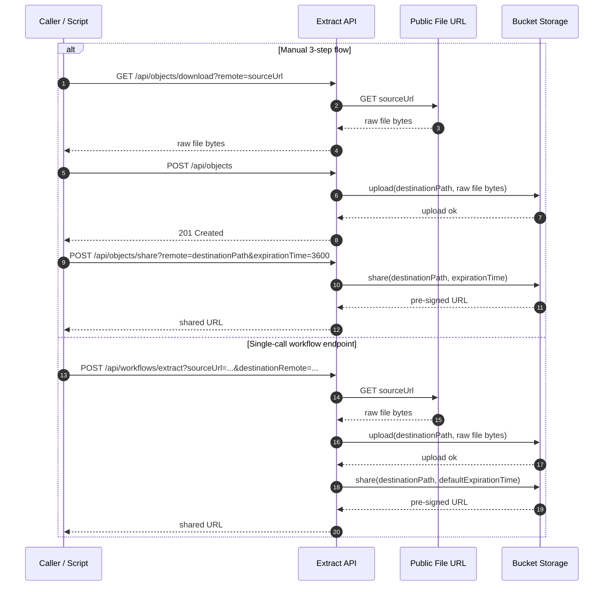

# Sprint 001 Extract Workflow

## Scope

For sprint 001, the Extract layer does only one thing:

1. Receive a single public link
2. Download the file behind that link
3. Upload the exact same file to the project bucket
4. Return a new pre-signed URL pointing to the uploaded file

Extract does not:

- parse ICS
- filter events
- call any external business API
- apply any business rule
- transform the content
- use MQTT for this sprint

If the input file is an ICS file, the output stored in the bucket is the same ICS file.

## Sprint 001 Objective

The goal of sprint 001 is to validate the minimal Extract responsibility:

- accept a public or pre-signed URL as input
- retrieve the raw file bytes
- store the same bytes in the target bucket
- make the uploaded file available through a new pre-signed URL

This sprint is a technical relay only. It is not yet the final orchestrated ETL communication model.

## Functional Principle

The Extract service is only a relay between:

- the public source URL provided for the file
- the internal storage bucket used by the ETL pipeline

The workflow is:

`download(sourceUrl) -> upload(destinationPath, byte[]) -> share(destinationPath, expirationTime)`

This workflow can now be executed in two ways:

- manually, by calling the existing endpoints one by one
- directly, through a single endpoint that executes the complete chain with the server-side default share expiration

## Sequence Diagram



## Sprint 001 Input

For this sprint, the minimum useful input is:

- `sourceUrl`: public or pre-signed URL of the source file
- `destinationPath`: target object path in the bucket
- `expirationTime`: validity duration of the returned shared URL when using the manual `share` endpoint

Example values:

```text
sourceUrl=https://public.example.com/calendar.ics
destinationPath=my-bucket/raw/job-2026-03-12-001/calendar.ics
expirationTime=3600
```

## Detailed Procedure

### 1. Receive the public link

The source file is made available through a public or pre-signed URL.

Example:

```text
https://public.example.com/calendar.ics
```

At sprint 001 level, this link can be provided manually.

### 2. Download the source file

Extract downloads the file from the provided URL.

Logical action:

```text
download(sourceUrl)
```

Result:

- the file is retrieved as raw bytes
- the content is kept exactly as received

There is no:

- ICS parsing
- event extraction
- normalization
- filtering

### 3. Upload the raw file to the bucket

Extract uploads the downloaded bytes to the chosen bucket path.

Logical action:

```text
upload(destinationPath, fileBytes)
```

Result:

- the exact same file is stored in the internal bucket
- the object key is the agreed target path

Recommended naming convention:

```text
raw/<source>/<job_id>/<filename>
```

Example:

```text
raw/calendar/job-2026-03-12-001/calendar.ics
```

### 4. Generate the new access URL

Extract generates a new shared URL for the uploaded object.

Logical action:

```text
share(destinationPath, expirationTime)
```

Result:

- the bucket returns a new pre-signed URL
- this URL is the main output of sprint 001 for the Extract layer
- for the single workflow endpoint, `expirationTime` is taken from server configuration instead of the request

## Manual REST Procedure

For sprint 001, the workflow can be tested manually with the existing REST API.

### Step 1. Download the file through Extract

```bash
curl --get \
  --data-urlencode "remote=https://public.example.com/calendar.ics" \
  http://localhost:8080/api/objects/download \
  --output calendar.ics
```

### Step 2. Upload the same file to the bucket

```bash
curl -X POST \
  -F "remote=my-bucket/raw/job-2026-03-12-001/calendar.ics" \
  -F "file=@calendar.ics" \
  http://localhost:8080/api/objects
```

### Step 3. Request the shared URL

```bash
curl -X POST --get \
  --data-urlencode "remote=my-bucket/raw/job-2026-03-12-001/calendar.ics" \
  --data-urlencode "expirationTime=3600" \
  http://localhost:8080/api/objects/share
```

## Single-Call Workflow Endpoint

The same sprint 001 workflow can also be executed with one endpoint:

```bash
curl -X POST --get \
  --data-urlencode "sourceUrl=https://public.example.com/calendar.ics" \
  --data-urlencode "destinationRemote=my-bucket/raw/job-2026-03-12-001/calendar.ics" \
  http://localhost:8080/api/workflows/extract
```

Result:

- Extract downloads the source file
- Extract uploads the same bytes to the destination bucket path
- Extract returns the final pre-signed URL directly
- the share expiration is resolved server-side from `WORKFLOW_SHARE_EXPIRATION_TIME` and defaults to `3600`

## Scripted Procedure

The same workflow can be executed with the helper script:

```bash
bash scripts/manual_extract_workflow.sh \
  "https://public.example.com/calendar.ics" \
  "my-bucket/raw/job-2026-03-12-001/calendar.ics" \
  3600 \
  "http://localhost:8080/api"
```

## Validation Rules

For sprint 001, Extract verifies only technical constraints:

- the source URL is present
- the destination path is present
- the destination path targets an object, not just a bucket root
- for the manual `share` endpoint, the expiration time is valid

Extract does not inspect the business content of the file.

## Output

The expected output of sprint 001 is a new pre-signed URL for the uploaded object.

Example:

```text
https://bucket.example.com/raw/job-2026-03-12-001/calendar.ics?signature=abc
```

## Acceptance Criteria

Sprint 001 is complete for Extract if:

- Extract accepts one public link as input
- Extract downloads the file successfully
- Extract uploads the exact same file to the bucket
- Extract returns a new pre-signed URL
- Extract does not modify file content
- Extract can be executed manually with the current REST API
- Extract can be executed through the single workflow endpoint

## Out of Scope

The following belongs to later stages or later sprints:

- MQTT-based orchestration
- reading ICS fields such as `UID`, `DTSTART`, or `DESCRIPTION`
- converting ICS to JSON
- generating SQL
- billing logic
- client detection through `[client]`
- duration calculation
- rate calculation
- event filtering by date
