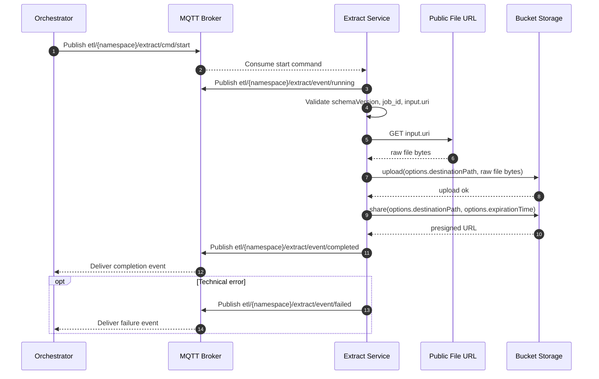

# Sprint 001 Extract Workflow

## Scope

For sprint 001, the Extract layer does only one thing:

1. Receive a single public link from the Orchestrator
2. Download the file behind that link
3. Upload the exact same file to the project bucket
4. Return a new pre-signed URL pointing to the uploaded file

Extract does not:

- parse ICS
- filter events
- call any external business API
- apply any business rule
- transform the content

If the input file is an ICS file, the output stored in the bucket is the same ICS file.

## Functional Principle

The Extract service is only a relay between:

- the public source URL provided by the Orchestrator
- the internal storage bucket used by the ETL pipeline

The workflow is:

`download(input.uri) -> upload(bucketPath, byte[]) -> share(bucketPath, expirationTime)`

## MQTT Contract Mapping

For sprint 001, Extract must follow the ETL MQTT communication contract.

### Consumed topic

```text
etl/{namespace}/extract/cmd/start
```

### Produced topics

```text
etl/{namespace}/extract/event/running
etl/{namespace}/extract/event/completed
etl/{namespace}/extract/event/failed
```

### Required message rules

- every message must contain `schemaVersion`
- every message must contain `job_id`
- the input public link is carried in `input.uri`
- output is returned in `output.uri`

### Mapping for Extract

- `input.uri`: source public URL received from the Orchestrator
- `output.uri`: new pre-signed URL generated after upload to the bucket
- `options.destinationPath`: target object path in the bucket
- `options.expirationTime`: validity duration of the returned pre-signed URL

## Sequence Diagram



## Command Payload

The Orchestrator sends the start command on:

```text
etl/{namespace}/extract/cmd/start
```

Recommended sprint 001 payload:

```json
{
  "schemaVersion": "1.0",
  "job_id": "job-2026-03-12-001",
  "input": {
    "uri": "https://public.example.com/calendar.ics"
  },
  "options": {
    "destinationPath": "raw/calendar/job-2026-03-12-001/calendar.ics",
    "expirationTime": 3600
  }
}
```

### Fields used by Extract

- `schemaVersion`: contract version
- `job_id`: unique identifier for traceability
- `input.uri`: public source link
- `options.destinationPath`: bucket object path
- `options.expirationTime`: pre-signed URL duration in seconds

### Minimum validation

Extract checks only technical constraints:

- `schemaVersion` is present
- `job_id` is present
- `input` is present
- `input.uri` is present
- `options.destinationPath` is present
- `options.expirationTime` is valid

Extract does not inspect the business content of the file.

## Event Payloads

### Running event

Topic:

```text
etl/{namespace}/extract/event/running
```

Example:

```json
{
  "schemaVersion": "1.0",
  "job_id": "job-2026-03-12-001",
  "progress": 0,
  "stats": {
    "items_processed": 0,
    "durationMs": 0
  }
}
```

This event must be published at least once when the job starts.

### Completed event

Topic:

```text
etl/{namespace}/extract/event/completed
```

Example:

```json
{
  "schemaVersion": "1.0",
  "job_id": "job-2026-03-12-001",
  "output": {
    "uri": "https://bucket.example.com/raw/calendar/job-2026-03-12-001/calendar.ics?signature=abc"
  }
}
```

This is the main success output of Extract in sprint 001.

### Failed event

Topic:

```text
etl/{namespace}/extract/event/failed
```

Example:

```json
{
  "schemaVersion": "1.0",
  "job_id": "job-2026-03-12-001",
  "error": {
    "code": "EXTRACT_DOWNLOAD_ERROR",
    "message": "Unable to download source file"
  }
}
```

## Detailed Procedure

### 1. Orchestrator publishes the start command

The Orchestrator publishes a JSON payload on:

```text
etl/{namespace}/extract/cmd/start
```

The only mandatory business input for sprint 001 is the public URL in `input.uri`.

### 2. Extract consumes and validates the command

Extract reads the message and verifies:

- contract fields are present
- the source URL exists in `input.uri`
- the bucket destination exists in `options.destinationPath`
- the expiration time exists in `options.expirationTime`

At this point, Extract publishes a `running` event.

### 3. Extract downloads the source file

Extract calls:

```text
download(input.uri)
```

Result:

- the file is downloaded as raw bytes
- the content is kept exactly as received

There is no:

- ICS parsing
- event extraction
- normalization
- filtering

### 4. Extract uploads the raw file to the bucket

Extract calls:

```text
upload(options.destinationPath, fileBytes)
```

Result:

- the exact same file is stored in the internal bucket
- the object key is the agreed target path

Recommended naming convention:

```text
raw/<source>/<job_id>/<filename>
```

Example:

```text
raw/calendar/job-2026-03-12-001/calendar.ics
```

### 5. Extract generates the new access URL

Extract calls:

```text
share(options.destinationPath, options.expirationTime)
```

Result:

- the bucket returns a new pre-signed URL
- this URL is published in `output.uri`

### 6. Extract publishes the final event

On success, Extract publishes:

```text
etl/{namespace}/extract/event/completed
```

with:

- `schemaVersion`
- `job_id`
- `output.uri`

On failure, Extract publishes:

```text
etl/{namespace}/extract/event/failed
```

with:

- `schemaVersion`
- `job_id`
- `error.code`
- `error.message`

## Operational Procedure

### Orchestrator side

1. Put the source ICS file behind a public URL or temporary signed URL.
2. Build the MQTT command payload using `schemaVersion`, `job_id`, `input.uri`, and `options`.
3. Publish the command on `etl/{namespace}/extract/cmd/start`.
4. Wait for either `etl/{namespace}/extract/event/completed` or `etl/{namespace}/extract/event/failed`.

### Extract side

1. Subscribe to `etl/{namespace}/extract/cmd/start`.
2. Consume the command message.
3. Publish `etl/{namespace}/extract/event/running`.
4. Download the file from `input.uri`.
5. Upload the downloaded bytes to `options.destinationPath`.
6. Generate a new pre-signed URL with `options.expirationTime`.
7. Publish `etl/{namespace}/extract/event/completed` with `output.uri`.
8. If an error occurs, publish `etl/{namespace}/extract/event/failed`.

### Downstream side

1. Read the completion event.
2. Recover `output.uri`.
3. Pass this URI to the next ETL stage when required.

## Acceptance Criteria

Sprint 001 is complete for Extract if:

- Extract consumes `etl/{namespace}/extract/cmd/start`
- Extract publishes at least one `event/running`
- Extract downloads the file from `input.uri`
- Extract uploads the exact same file to the bucket
- Extract publishes `event/completed` with `output.uri`
- Extract publishes `event/failed` on technical errors
- Extract does not modify file content

## Out of Scope

The following belongs to later stages or later sprints:

- reading ICS fields such as `UID`, `DTSTART`, or `DESCRIPTION`
- converting ICS to JSON
- generating SQL
- billing logic
- client detection through `[client]`
- duration calculation
- rate calculation
- event filtering by date
