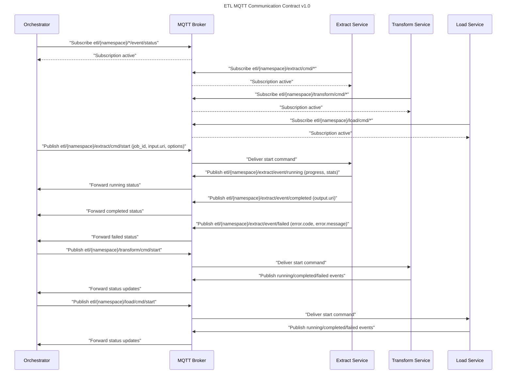

# ETL MQTT Communication Contract v1.0

```mermaid
sequenceDiagram
    title ETL MQTT Communication Contract v1.0

    participant Orchestrator
    participant Broker as MQTT Broker
    participant Extract as Extract Service
    participant Transform as Transform Service
    participant Load as Load Service

    Orchestrator->>Broker: "Subscribe etl/{namespace}/*/event/status"
    Broker-->>Orchestrator: "Subscription active"

    Extract->>Broker: "Subscribe etl/{namespace}/extract/cmd/*"
    Broker-->>Extract: "Subscription active"

    Transform->>Broker: "Subscribe etl/{namespace}/transform/cmd/*"
    Broker-->>Transform: "Subscription active"

    Load->>Broker: "Subscribe etl/{namespace}/load/cmd/*"
    Broker-->>Load: "Subscription active"

    Orchestrator->>Broker: "Publish etl/{namespace}/extract/cmd/start (job_id, input.uri, options)"
    Broker->>Extract: "Deliver start command"

    Extract->>Broker: "Publish etl/{namespace}/extract/event/running (progress, stats)"
    Broker->>Orchestrator: "Forward running status"

    Extract->>Broker: "Publish etl/{namespace}/extract/event/completed (output.uri)"
    Broker->>Orchestrator: "Forward completed status"

    Extract->>Broker: "Publish etl/{namespace}/extract/event/failed (error.code, error.message)"
    Broker->>Orchestrator: "Forward failed status"

    Orchestrator->>Broker: "Publish etl/{namespace}/transform/cmd/start"
    Broker->>Transform: "Deliver start command"
    Transform->>Broker: "Publish running/completed/failed events"
    Broker->>Orchestrator: "Forward status updates"

    Orchestrator->>Broker: "Publish etl/{namespace}/load/cmd/start"
    Broker->>Load: "Deliver start command"
    Load->>Broker: "Publish running/completed/failed events"
    Broker->>Orchestrator: "Forward status updates"
```
